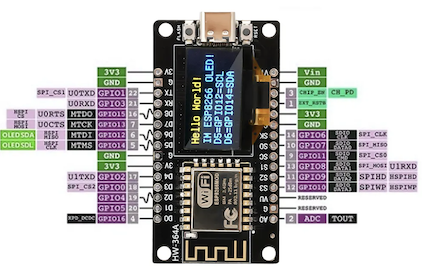
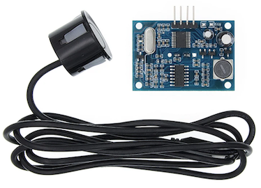
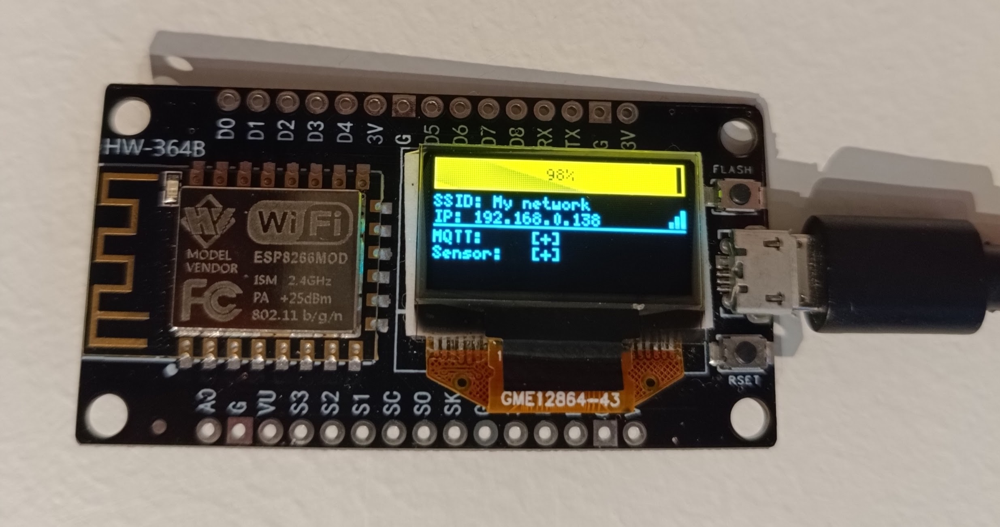
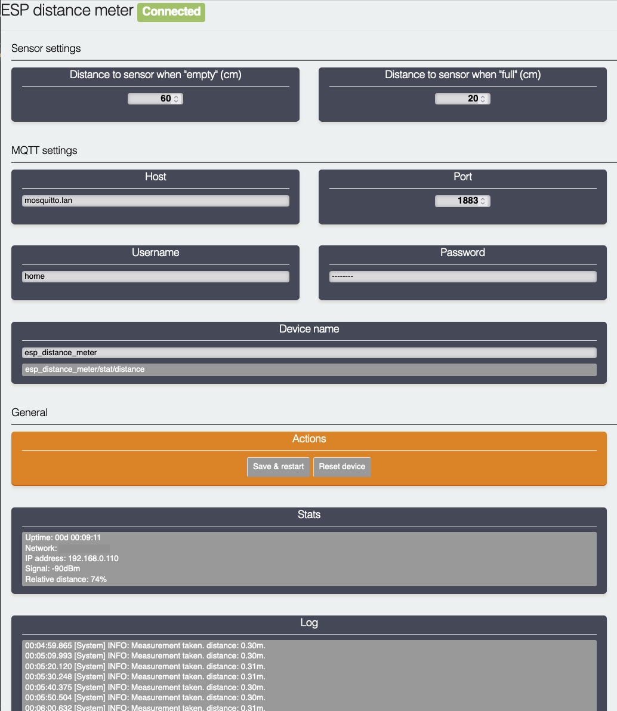

# ESP8266 Ultrasonic distance meter

Allows you to measure absolute & relative distance, and send it to MQTT. Provides HomeAssistant sensor autodiscovery.

This project was inspired by [WaterLevelSensorMQTT](https://github.com/portfedh/WaterLevelSensorMQTT).

## Required components

* NodeMCU ESP8266 Development Board ~4EUR
  * Recommend buying the one with builtin 0.96in display
* JSN-SR04T Ultrasonic Module ~3.5EUR




Final result



## Setup

1. Connect sensor's `TRIG` pin to `D1` and `ECHO` pin to `D2`. Take 5V from the `VU` pin. Connect `Ground` to any `G` pin.
1. Optional 128x64 OLED display can be connected - `D5` as `SCL` and `D6` as `SDA`. With builtin display it works out of the box.
1. At first, the `WiFiManager` will set up an AccessPoint, connect to `ESP_distance_meter` WiFi and configure connection to your local network. Restart the NodeMCU when done.
1. Navigate with the browser to the device's IP address. It is displayed on the LCD or printed to Serial.
1. Enter all needed parameters in the admin dashboard.



### Configuring distances

The meter has to know some heights in advance, it uses them to calculate the percantage filled or absolute column height.

#### Distance to sensor when "empty"

Provide the distance in centimeters from the bottom, or your defined minimum of "something" to the sensor.
It means that at this distance the container is "empty".

#### Distance to sensor when "full"

Provide the distance in centimeters from the top, or your defined maximum of "something" to the sensor.
It means that at this distance the container is "full".

## Measurements

HomeAssintant's autoconfiguration message is published to MQTT. You should be able to find the Entity under MQTT integration.

By default, the current state will be published to `esp_distance_meter/stat/distance` topic. It contains a JSON with the following structure:

* `relative` - a percentage of how much the container is filled.
* `absolute` - calculated height in meters of "something" in the container.
* `measured` - a raw distance measured in meters from sensor to the surface.

```json
{
    "relative": 0.73,
    "absolute": 1.12,
    "measured": 1.51
}
```

The example above tells that the container is filled to 73%, the height of something is 1.12 meters. Raw measured distance from the sensor to something is 1.51 meters.
